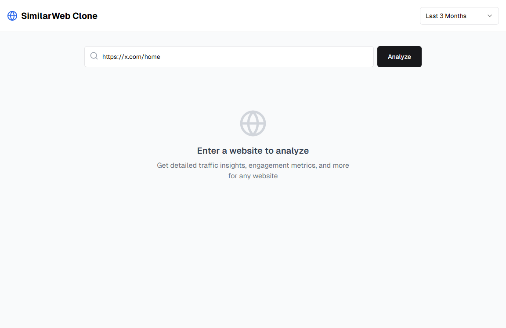
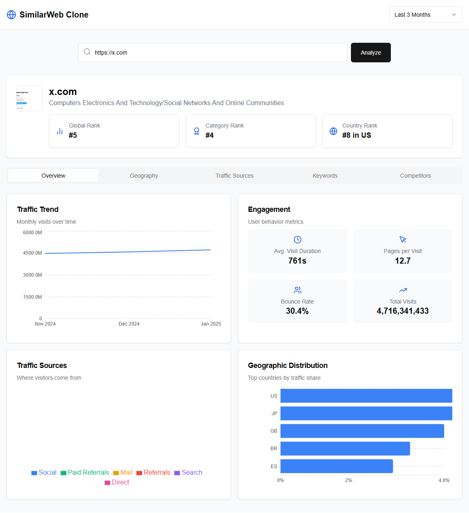

# 🚀 SimilarWeb Clone

A web analytics dashboard inspired by SimilarWeb, built with Next.js, React, and the SimilarWeb Traffic API. This application allows users to analyze website traffic data, including visitor statistics, engagement metrics, traffic sources, and more.

## 🎉 Features

- **Website Analysis**: Enter any domain to get detailed traffic insights.
- **Traffic Trends**: Visualize monthly visit data over time.
- **Engagement Metrics**: View bounce rate, pages per visit, and average visit duration.
- **Traffic Sources**: Detailed breakdown of traffic channels, including direct visits, search engines, referrals, social media, email campaigns, and paid advertising.
- **Geographic Distribution**: See which countries are driving the most traffic.
- **Top Keywords**: Discover the search terms bringing visitors to the site.
- **Responsive Design**: Fully responsive interface that works on desktop and mobile devices.

## 📷 Screenshots

### Site Overview

 
## 🚧 Getting Started

### 🚨 Prerequisites

- Node.js (v14 or later)
- npm or yarn
- A RapidAPI account and API key for the SimilarWeb Traffic API

### 🚀 Installation

1. Clone the repository:
